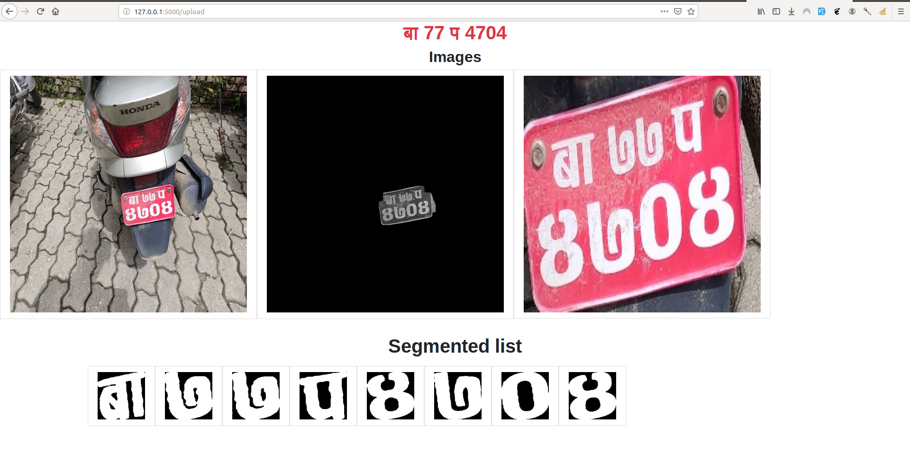

# nepali-number-plate-detection
this project is capable of detecting and predicting backplate of the motorcycle of the bagmati zone
this system has 98% train accuracy 89% test accuracy when tested on backplate of the motorbike 

